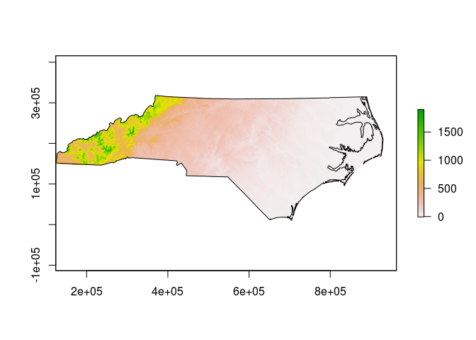
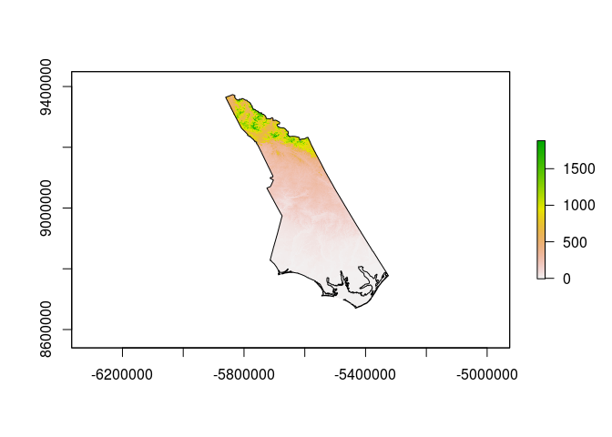

A question on the R-sig-geo mailing list came up that got me thinking about how much I know about coordinate reference systems (CRS) when working with spatial data in R. Turns out I know how to do the basic stuff, but it's hard to remember how everything works together, so to aid my memory and for anyone with the question, here are some basic methods to answer the question: How do I make sure all my data is in the same coordinate system?

First, we need to load some basic R libraries:

``` r
library(sp)
library(rgdal)
```

    ## rgdal: version: 1.1-10, (SVN revision 622)
    ##  Geospatial Data Abstraction Library extensions to R successfully loaded
    ##  Loaded GDAL runtime: GDAL 2.1.0, released 2016/04/25
    ##  Path to GDAL shared files: /usr/share/gdal/2.1
    ##  Loaded PROJ.4 runtime: Rel. 4.9.2, 08 September 2015, [PJ_VERSION: 492]
    ##  Path to PROJ.4 shared files: (autodetected)
    ##  Linking to sp version: 1.2-3

``` r
library(raster)
library(gdalUtils)
```

Set Up A Target CRS
-------------------

The original question had an existing proj4 string that we will call the desired CRS:

``` r
# set the desired CRS
desired_crs<-CRS("+proj=lcc +lat_1=49 +lat_2=44 +lat_0=46.5 +lon_0=3 +x_0=700000 +y_0=6600000 +ellps=GRS80 +units=m +no_defs")
```

If you don't know what all that means, you should probably go [read this](http://proj4.org/index.html) before going any further.

For extra credit, [here is the Snyder book](https://pubs.usgs.gov/pp/1395/report.pdf) which includes the parameters and equations for most map projections you are likely to encounter.

Get some data to work with
--------------------------

I don't intend to get too fancy here - for most people, working with shapefiles and geoTIFF images is plenty complicated. Looking on my laptop, I have some suitable data that appears to be distributed with the [OSGeo Live! distribution](https://live.osgeo.org/en/index.html), specifically the North Carolina datasets that appear to have been originally published with the book Open Source GIS: A GRASS GIS Approach. The data may be [downloaded](https://grassbook.org/datasets/datasets-3rd-edition/) directly from the support site for that book as well.

I'll load the state boundary from a shapefile, and a low resolution DEM as a geoTIFF. Note the way a shapefile is loaded using readOGR, you have to give the directory and the name of the shapefile (without the extension) as two separate parameters, whereas the raster loader just wants a path to the geoTIFF file.

``` r
# load some data - first some vectors
shapedir<-"/home/dave/data/north_carolina/shape/"
random_shapefile<-"nc_state"
actual_shapefile<-readOGR(shapedir, random_shapefile)
```

    ## OGR data source with driver: ESRI Shapefile 
    ## Source: "/home/dave/data/north_carolina/shape/", layer: "nc_state"
    ## with 8 features
    ## It has 3 fields

    ## Warning in readOGR(shapedir, random_shapefile): Z-dimension discarded

``` r
# now with Raster
random_rasterfile<-"/home/dave/data/north_carolina/rast_geotiff/elev_state_500m.tif"
GDALinfo(random_rasterfile)
```

    ## Warning: statistics not supported by this driver

    ## rows        669 
    ## columns     1678 
    ## bands       1 
    ## lower left origin.x        124000 
    ## lower left origin.y        -16000 
    ## res.x       500 
    ## res.y       500 
    ## ysign       -1 
    ## oblique.x   0 
    ## oblique.y   0 
    ## driver      GTiff 
    ## projection  +proj=lcc +lat_1=36.16666666666666 +lat_2=34.33333333333334
    ## +lat_0=33.75 +lon_0=-79 +x_0=609601.22 +y_0=0 +datum=NAD83
    ## +units=m +no_defs 
    ## file        /home/dave/data/north_carolina/rast_geotiff/elev_state_500m.tif 
    ## apparent band summary:
    ##    GDType hasNoDataValue NoDataValue blockSize1 blockSize2
    ## 1 Float32           TRUE       -9999          1       1678
    ## apparent band statistics:
    ##          Bmin       Bmax Bmean Bsd
    ## 1 -4294967295 4294967295    NA  NA
    ## Metadata:
    ## AREA_OR_POINT=Area

``` r
actual_rasterfile<-raster(random_rasterfile)
plot(actual_rasterfile)
plot(actual_shapefile, add=TRUE)
```



Exploring the CRS definitions
-----------------------------

Each of the objects created above will have a CRS definition that we can look at in various ways.

``` r
# have a look at the CRS info for the shapefile
actual_shapefile@proj4string  # a direct look at the object attributes
```

    ## CRS arguments:
    ##  +proj=lcc +lat_1=36.16666666666666 +lat_2=34.33333333333334
    ## +lat_0=33.75 +lon_0=-79 +x_0=609601.22 +y_0=0 +datum=NAD83
    ## +units=m +no_defs +ellps=GRS80 +towgs84=0,0,0

``` r
CRS(proj4string(actual_shapefile))  # use gdal functions to access the object attributes
```

    ## CRS arguments:
    ##  +proj=lcc +lat_1=36.16666666666666 +lat_2=34.33333333333334
    ## +lat_0=33.75 +lon_0=-79 +x_0=609601.22 +y_0=0 +datum=NAD83
    ## +units=m +no_defs +ellps=GRS80 +towgs84=0,0,0

``` r
identical(actual_shapefile@proj4string, CRS(proj4string(actual_shapefile))) # TRUE
```

    ## [1] TRUE

``` r
identical(actual_shapefile@proj4string, desired_crs) # FALSE
```

    ## [1] FALSE

``` r
CRSargs(actual_shapefile@proj4string)  # extract the arguments as a character vector
```

    ## [1] "+proj=lcc +lat_1=36.16666666666666 +lat_2=34.33333333333334 +lat_0=33.75 +lon_0=-79 +x_0=609601.22 +y_0=0 +datum=NAD83 +units=m +no_defs +ellps=GRS80 +towgs84=0,0,0"

``` r
# compare with the raster image
# we can use the identicalCRS function here, because both of our objects have a proj4string attribute
identicalCRS(actual_shapefile, actual_rasterfile) # TRUE
```

    ## [1] TRUE

``` r
# sadly, we can't use identicalCRS with our desired_crs variable
identical(proj4string(actual_rasterfile), desired_crs) # FALSE
```

    ## [1] FALSE

Transform the Vector Data
-------------------------

There are ways to directly change the CRS definitions of the loaded data, but in most cases doing so would be an error since the actual coordinates of the object are still referenced to the original CRS. If we want a different projection, we need to transform or warp the object. Starting with the Vectors:

``` r
# transform to the desired CRS
transformed_shapefile<-spTransform(actual_shapefile, desired_crs)
identical(transformed_shapefile@proj4string, desired_crs) # TRUE
```

    ## [1] TRUE

Transform the Raster Data
-------------------------

Things are a little trickier with the raster, mainly due to the memory requirements of reprojection. The raster library includes a projectRaster() function but the performance is poor and it requires a lot of free RAM for large datasets. I prefer to either call gdalwarp from the command line or use the gdalUtils implementation. Note that the gdalwarp function works from the original file on disk:

``` r
# reproject the raster
# the Raster method is not very efficient but here is the command
# transformed_rasterfile<-projectRaster(actual_rasterfile, crs=desired_crs)
# use the gdal utilities instead
transformed_rasterfile<-"/home/dave/test_reprojected.tif"
gdalwarp(random_rasterfile, dstfile=transformed_rasterfile, t_srs=desired_crs@projargs)
```

    ## NULL

``` r
GDALinfo(transformed_rasterfile)
```

    ## Warning: statistics not supported by this driver

    ## rows        1786 
    ## columns     1426 
    ## bands       1 
    ## lower left origin.x        -6009309 
    ## lower left origin.y        8539688 
    ## res.x       509.0241 
    ## res.y       509.0241 
    ## ysign       -1 
    ## oblique.x   0 
    ## oblique.y   0 
    ## driver      GTiff 
    ## projection  +proj=lcc +lat_1=49 +lat_2=44 +lat_0=46.5 +lon_0=3 +x_0=700000
    ## +y_0=6600000 +ellps=GRS80 +units=m +no_defs 
    ## file        /home/dave/test_reprojected.tif 
    ## apparent band summary:
    ##    GDType hasNoDataValue NoDataValue blockSize1 blockSize2
    ## 1 Float32           TRUE       -9999          1       1426
    ## apparent band statistics:
    ##          Bmin       Bmax Bmean Bsd
    ## 1 -4294967295 4294967295    NA  NA
    ## Metadata:
    ## AREA_OR_POINT=Area

``` r
# load the new file
actual_transformed<-raster(transformed_rasterfile)
identicalCRS(transformed_shapefile, actual_transformed) # TRUE
```

    ## [1] TRUE

Check the results
-----------------

Our transformed data should line up:

``` r
plot(actual_transformed)
plot(transformed_shapefile,add=TRUE)
```



Note the *very* different appearance - this is what we would expect when changing to a radically different projection.
