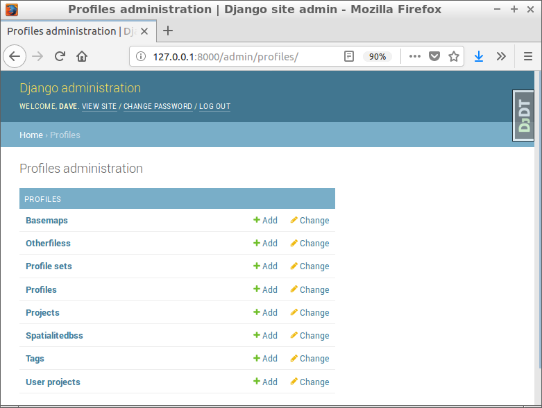
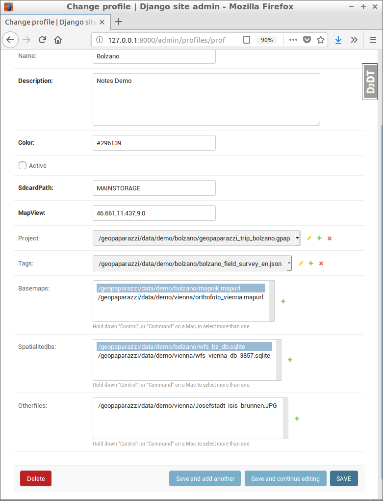
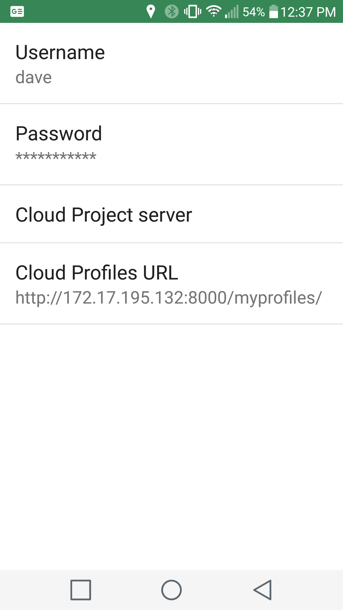
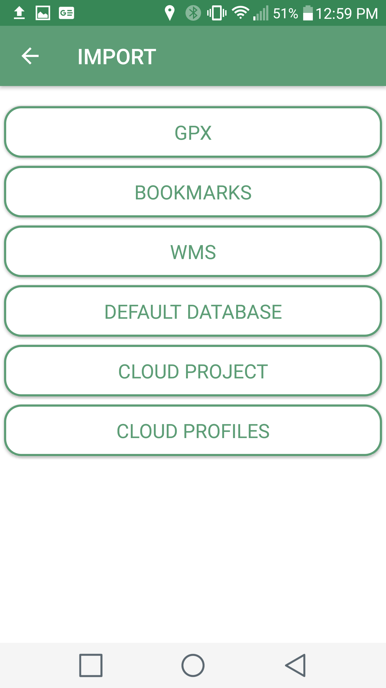
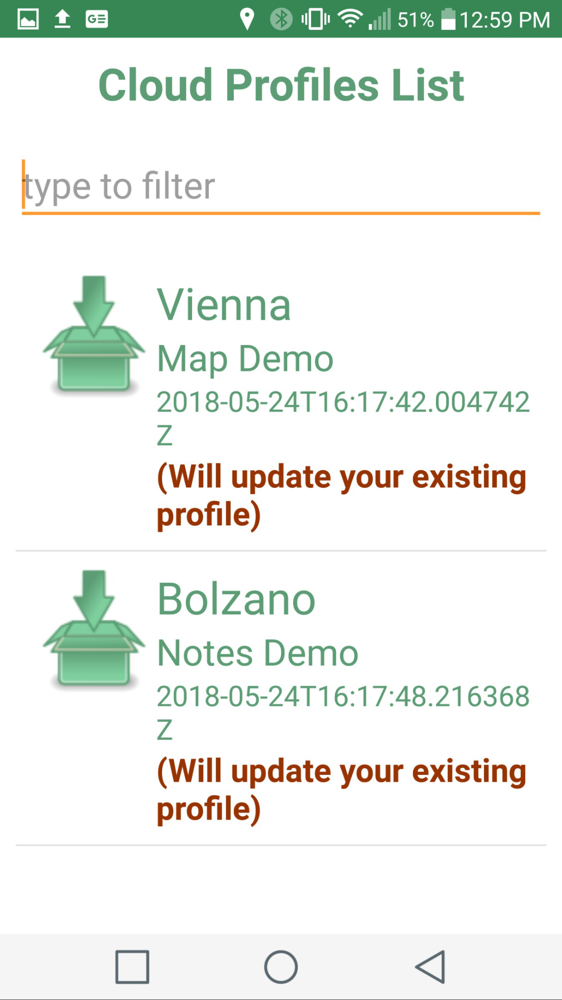

We have been working with the [geopaparazzi mobile app](https://github.com/geopaparazzi/geopaparazzi).  This is a very interesting app with a lot of capabilities, but setting it up is a pretty daunting prospect for a casual user.  The first order of business is to make the download/upload of maps and user data easier.  This is done using 'cloud profiles' which collect all the basemap, spatialite DBs, forms and other requirements into a listing served as a JSON stream that references the download links.  This approach can be satisfied with hand assembled files hosted on a cloud service, the details are [described in the user manual](http://geopaparazzi.github.io/geopaparazzi/#_geopaparazzi_cloud_server).    

To do anything more complex on the server side will require some infrastructure, including a database and scripting environment.  To make it easier for prospective developers to get a server set up with a minimum of effort without sacrificing security concerns, I have created a [cookiecutter recipe](https://github.com/audreyr/cookiecutter) to quickly stand up a server for testing or production using some of the best open source code.         

# Features    

* PostgreSQL/PostGIS database    
* Secure web server (TLS/HTTPS) using Caddy and free LetsEncrypt! certificates    
* Django/Python web framework for powerful scripting and templating   
* RESTful services implemented with Django-Rest-Framework    
* Mobile ready web forms with Crispyforms and Bootstrap    
* Advanced user registration with django-allauth     

# Getting Started   

There are a number of options for setting up the server, including:    

* running the django server behind your own HTTP server (eg Apache or Nginx)    
* using a set of Docker containers to provide all database and server functions    
* hosting on Heroku or PythonAnywhere    

If you are comfortable with managing your own server and database then the first option may be appealing.  I haven't tested the third party hosting services, but have had good success with using the Docker option on my Ubuntu laptop and on cloud servers, so that is what I would recommend.  To try the server out, you will need to install [Docker](https://docs.docker.com/install/) and [Docker-compose](https://docs.docker.com/compose/install/).  Next, install [cookiecutter](https://cookiecutter.readthedocs.io/en/latest/)    

```
$ pip install "cookiecutter>=1.4.0"
```

Now run it against this repo:

```
$ cookiecutter https://github.com/geoanalytic/cookiecutter-geopaparazzi-server
```

You will be asked for some values, here is what I did.  Important things right now:   

* use docker and whitenoise   
* do not use mailhog, sentry, heroku, or travisci    
* replace any references to David Currie, trailstewards.com, etc with your own information.    

```
project_name [My Awesome Project]: geopap_testserver
project_slug [geopap_testserver]: 
description [Behold My Awesome Project!]: 
author_name [Daniel Roy Greenfeld]: David Currie
email [david-currie@example.com]: dave@trailstewards.com
domain_name [example.com]: trailstewards.com
version [0.1.0]: 
Select open_source_license:
1 - MIT
2 - BSD
3 - GPLv3
4 - Apache Software License 2.0
5 - Not open source
Choose from 1, 2, 3, 4, 5 [1]: 
timezone [UTC]: 
windows [n]: 
use_pycharm [n]: 
use_docker [n]: y
postgresql_version [10.3]: 
Select js_task_runner:
1 - None
2 - Gulp
3 - Grunt
Choose from 1, 2, 3 [1]: 
custom_bootstrap_compilation [n]: 
use_compressor [n]: 
use_celery [n]: 
use_mailhog [n]: 
use_sentry_for_error_reporting [y]: n
use_whitenoise [y]: 
use_heroku [n]: 
use_travisci [n]: 
keep_local_envs_in_vcs [y]: 
 [SUCCESS]: Project initialized, keep up the good work!
```

# Set Up A Local Server    

Now cd into the directory that was just created for you using the project_slug name given above and have a look at the contents.  There are two key files that drive the `docker-compose` command appropriately named local.yml and production.yml.  For testing and development work, we can build a local server with this command:

```
$ cd geopap_testserver
$ docker-compose -f local.yml build
```

This will take a while and will download a bunch of docker stuff.  When the build is finished, fire up the local service and run the tests.    

```
$ docker-compose -f local.yml up -d
Creating network "geopaptestserver_default" with the default driver
Creating volume "geopaptestserver_postgres_data_local" with default driver
Creating volume "geopaptestserver_postgres_backup_local" with default driver
Creating geopaptestserver_postgres_1
Creating geopaptestserver_django_1

$ docker-compose -f local.yml run --rm django py.test
PostgreSQL is up - continuing...
Test session starts (platform: linux, Python 3.6.1, pytest 3.5.0, pytest-sugar 0.9.1)
Django settings: config.settings.test (from ini file)
rootdir: /app, inifile: pytest.ini
plugins: sugar-0.9.1, django-3.1.2

 geopap_testserver/users/tests/test_admin.py ✓✓                                                                                   4% ▍         
 geopap_testserver/users/tests/test_models.py ✓✓                                                                                  7% ▊         
 geopap_testserver/users/tests/test_urls.py ✓✓✓✓✓✓✓✓                                                                             22% ██▎       
 geopap_testserver/users/tests/test_views.py ✓✓✓                                                                                 28% ██▊       
 profiles/tests/test_api.py ✓✓✓✓✓✓✓✓✓✓✓✓✓✓✓✓✓✓✓✓✓✓✓                                                                              70% ███████▏  
 profiles/tests/test_models.py ✓✓✓✓✓✓✓✓✓✓✓✓✓✓✓✓                                                                                 100% ██████████

Results (27.92s):
      54 passed
```

[Here is the reference to all the `docker-compose` commands.](https://docs.docker.com/compose/)  The important thing to remember in this case is that the -f parameter is necessary for all our commands in order to ensure that the docker network and associated containers are loaded correctly.  So far, we have executed three of these commands.  In the first instance (build), our containers were created and loaded with software and resources.     
The next command (up) starts the whole thing, and as you can see you get a database container running PostGIS and another one running Django/python.  If you leave off the -d option here, you will see all the startup messages for both containers but will need another console in order to interact with the system.

The third command (run) starts up another Django/python container instance just to run the tests.  The --rm option is included to ensure the container is removed when the tests are complete.  This will save some disk space.   

Everything seems to be working?  Now create a superuser.

```
$ docker-compose -f local.yml run --rm django python manage.py createsuperuser
PostgreSQL is up - continuing...
Username: dave
Email address: dave@trailstewards.com
Password: 
Password (again): 
Superuser created successfully.
```

Now point your browser to http://127.0.0.1:8000 and you should see the default welcome page.    
You can construct a profile through the admin interface at http://127.0.0.1:8000/admin, login as the superuser created above.    
The RESTful urls all require login credentials, and include:    

* http://127.0.0.1:8000/projects/    
* http://127.0.0.1:8000/tags/    
* http://127.0.0.1:8000/otherfiles/         
* http://127.0.0.1:8000/spatialitedbs/    
* http://127.0.0.1:8000/profiles/    
* http://127.0.0.1:8000/myprofiles/    

# Load Some Data    

Cloud profiles include a number of downloadable files that must be created and supplied in some way.  Using [this sample dataset](https://drive.google.com/file/d/1r5EJa4iyERstP3Z_Gd3_UYbHviP92ePX/view?usp=sharing), we can walk through the steps to set up a cloud profile on our local server.  First download and unzip the sample dataset.  You will see a number of files, organized something like this:    

```
./demo
├── bolzano
│   ├── bolzano_field_survey_en.json
│   ├── geopaparazzi_trip_bolzano.gpap
│   ├── mapnik.mapurl
│   ├── profile.json
│   └── wfs_bz_db.sqlite
├── load_local.sh
├── profiles_demo.json
└── vienna
    ├── geopaparazzi_trip_vienna.gpap
    ├── Josefstadt_isis_brunnen.JPG
    ├── orthofoto_vienna.mapurl
    ├── profile.json
    ├── tags.json
    └── wfs_vienna_db_3857.sqlite
```

You can inspect the `profiles_demo.json` file to see how everything is referenced.  We have a few options for getting this data on our server.  Using the Django admin interface at http://127.0.0.1:8000/admin we could manually upload each file and fill in the appropriate metadata fields, but this is unnecessary.  The quick way is to use the RESTful endpoints noted above.  This can be done from the command line using [Curl](https://curl.haxx.se/download.html) or [Httpie](https://httpie.org/).  The `load_local.sh` script can be used to load our data using Httpie.  Edit the file and replace the user:password parts with the superuser name and password you created earlier:   

```
$ cd data/demo
$ chmod +x load_local.sh
$ ./load_local.sh
```

The files should all now be uploaded, but the linkages between the support files and the profiles needs to be created using the Django admin interface.  Point your browser at http://127.0.0.1:8000/admin/profiles and you should see something like this:    

    

You can use this interface to create/read/update/delete (CRUD) any of the records in the database, but for now we will just use it to fill in the relationships between the profiles and other files and to create profilesets for geopaparazzi users.  Select the `Profiles` link and then the Bolzano option, you will get an edit screen as shown:    

    

You need to select the appropriate Project, Tags, Basemaps, Spatialitedbs and Otherfiles for each profile, then click the SAVE button to commit the relationships.  Don't worry about getting it wrong, these edits can be changed at any time, and it is possible to have multiple profiles referencing the same support files.  Follow the same process for the Vienna profile.    

Now go to http://127.0.0.1:8000/admin/profilesets which is where the user is linked to one or more profiles.  Click the ADD PROFILE SET button to get a window as shown, select the user and one or more of the Profiles and click SAVE.    

   

If you point your browser at this RESTful url (http://127.0.0.1:8000/myprofiles/) you should see the desired JSON.    

```json
{
    "formatVersion": 1.1,
    "profiles": [
        {
            "name": "Vienna",
            "description": "Map Demo",
            "creationdate": "2018-05-24T16:17:42.004742Z",
            "modifieddate": "2018-05-24T16:17:42.004776Z",
            "color": "#FBC02D",
            "active": true,
            "sdcardPath": "MAINSTORAGE",
            "mapView": "48.2129,16.3663,15.0",
            "project": {
                "path": "/geopaparazzi/data/demo/vienna/geopaparazzi_trip_vienna.gpap",
                "modifieddate": "2018-05-24T16:17:37.060229Z",
                "url": "http://172.17.195.132:8000/media/projects/geopaparazzi_trip_vienna.gpap",
                "uploadurl": "http://127.0.0.1:8000/userprojects/",
                "size": "110592"
            },
            "basemaps": [
                {
                    "path": "/geopaparazzi/data/demo/vienna/orthofoto_vienna.mapurl",
                    "modifieddate": "2018-05-24T16:17:38.197389Z",
                    "url": "http://172.17.195.132:8000/media/basemaps/orthofoto_vienna.mapurl",
                    "size": "267"
                }
            ],
            "spatialitedbs": [
                {
                    "path": "/geopaparazzi/data/demo/vienna/wfs_vienna_db_3857.sqlite",
                    "modifieddate": "2018-05-24T16:17:39.551436Z",
                    "url": "http://172.17.195.132:8000/media/spatialitedbs/wfs_vienna_db_3857.sqlite",
                    "size": "9795584",
                    "uploadurl": "http://127.0.0.1:8000/userprojects/",
                    "visible": [
                        "monumfountain"
                    ]
                }
            ],
            "otherfiles": [
                {
                    "path": "/geopaparazzi/data/demo/vienna/Josefstadt_isis_brunnen.JPG",
                    "modifieddate": "2018-05-24T16:17:40.792060Z",
                    "url": "http://172.17.195.132:8000/media/otherfiles/Josefstadt_isis_brunnen.JPG",
                    "size": "440927"
                }
            ]
        },
        {
            "name": "Bolzano",
            "description": "Notes Demo",
            "creationdate": "2018-05-24T16:17:48.216368Z",
            "modifieddate": "2018-05-24T16:17:48.216407Z",
            "color": "#296139",
            "active": false,
            "sdcardPath": "MAINSTORAGE",
            "mapView": "46.661,11.437,9.0",
            "project": {
                "path": "/geopaparazzi/data/demo/bolzano/geopaparazzi_trip_bolzano.gpap",
                "modifieddate": "2018-05-24T16:17:43.509074Z",
                "url": "http://172.17.195.132:8000/media/projects/geopaparazzi_trip_bolzano.gpap",
                "uploadurl": "http://127.0.0.1:8000/userprojects/",
                "size": "110592"
            },
            "tags": {
                "path": "/geopaparazzi/data/demo/bolzano/bolzano_field_survey_en.json",
                "modifieddate": "2018-05-24T16:17:44.621033Z",
                "url": "http://172.17.195.132:8000/media/tags/bolzano_field_survey_en.json",
                "size": "33247"
            },
            "basemaps": [
                {
                    "path": "/geopaparazzi/data/demo/bolzano/mapnik.mapurl",
                    "modifieddate": "2018-05-24T16:17:45.743737Z",
                    "url": "http://172.17.195.132:8000/media/basemaps/mapnik.mapurl",
                    "size": "321"
                }
            ],
            "spatialitedbs": [
                {
                    "path": "/geopaparazzi/data/demo/bolzano/wfs_bz_db.sqlite",
                    "modifieddate": "2018-05-24T16:17:47.030563Z",
                    "url": "http://172.17.195.132:8000/media/spatialitedbs/wfs_bz_db.sqlite",
                    "size": "13970432",
                    "uploadurl": "http://127.0.0.1:8000/userprojects/",
                    "visible": [
                        "administrativeunit"
                    ]
                }
            ],
            "otherfiles": []
        }
    ]
}
```

Now we can test with Geopaparazzi.  On your mobile, start the app and select the settings (gear) icon, then select Cloud Server Settings and fill in the user, password and Cloud Profiles URL as shown:    

   

Return to the main screen and tap the Import (lower left) icon, then tap Cloud Profiles.  The Vienna and Bolzano profiles should be shown as available for download.   

{:height="50%" width="50%"}     

{:height="50%" width="50%"}     

That's it for now.  This server currently provides minimal functionality, and contributions from other members of the community are welcome, please feel free to fork the repository and send me a pull request.  I'll be adding more postings shortly on how to:    

* deploy a production version on the cloud    
* manage email, user accounts and social media signups    
* store media files on Amazon S3 buckets (and similar services)     
* add functionality to the Django code, testing and collaboration    

